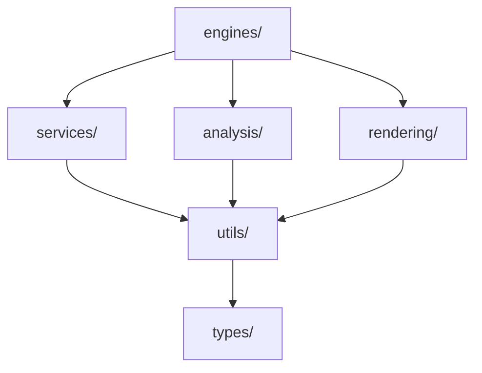

# Monaco Editor with NES (Next Edit Suggestions)


> **重新定义代码辅助体验**：不仅仅是补全，而是预测你的下一步编辑意图。

基于 Monaco Editor 和 DeepSeek V3/R1 构建的智能编辑器，采用创新的 **Dual Engine (双引擎)** 架构，将毫秒级补全与深思熟虑的预测完美融合。

## 🧠 核心架构：Dual Engine

我们设计了双轨制的处理引擎，以平衡响应速度与智能深度：

| 特性 | Fast Engine (Ghost Text) | Slow Engine (NES) |
|------|--------------------------|-------------------|
| **场景** | 实时代码补全 | 复杂的重构、修改预测 |
| **触发** | 键入时实时触发 | 编辑停顿后 (Debounce) |
| **UI** | 灰色幽灵文本 (Ghost Text) | 侧边栏 Glyph 箭头 + Diff 预览 |
| **模型** | DeepSeek-Coder (Fill-In-Middle) | DeepSeek-Chat/Reasoner |
| **延迟** | < 300ms | 1.5s - 3s |

## 📂 项目结构与架构设计

我们采用分层架构 (Layered Architecture) 来组织代码，确保指责分明，依赖方向单向流动。

### 目录结构

```text
monaco-editor-ai/
├── src/
│   ├── index.ts                   # 🚪 主入口
│   ├── config.ts                  # ⚙️ 全局配置
│   │
│   ├── engines/                   # 🧠 [核心业务层] 协调各模块流程
│   │   ├── FIMEngine.ts           #    FIM 实时补全引擎
│   │   └── NESEngine.ts           #    NES 下一步编辑预测引擎
│   │
│   ├── services/                  # 🛠️ [服务层] 状态管理与外部通信
│   │   ├── PredictionService.ts   #    API 调用服务
│   │   ├── EditHistoryManager.ts  #    编辑历史追踪
│   │   ├── SuggestionQueue.ts     #    建议队列管理
│   │   └── EditDispatcher.ts      #    事件分发
│   │
│   ├── analysis/                  # 🔍 [分析层] 代码理解
│   │   ├── SymptomDetector.ts     #    编辑症状检测
│   │   ├── TreeSitterAnalyzer.ts  #    AST 深度分析
│   │   └── CodeParser.ts          #    基础代码解析
│   │
│   ├── rendering/                 # 🎨 [渲染层] UI 呈现
│   │   ├── NESRenderer.ts         #    NES 渲染协调器
│   │   ├── DecorationManager.ts   #    Monaco 装饰器管理
│   │   ├── ViewZoneManager.ts     #    行间视图管理
│   │   └── styles.css             #    组件样式
│   │
│   ├── utils/                     # 🧰 [工具层] 通用算法
│   │   ├── CoordinateFixer.ts     #    坐标漂移修复
│   │   ├── PositionFinder.ts      #    智能位置查找
│   │   ├── DiffCalculator.ts      #    文本差异计算
│   │   └── TabKeyHandler.ts       #    按键拦截处理
│   │
│   └── types/                     # 📝 类型定义
│
├── server/                        # 🔌 后端服务
└── docs/                          # 📚 文档中心
```

### 架构分层与依赖原则

我们遵循 **严格的单向依赖原则**，上层可以依赖下层，下层不可依赖上层。

| 层级 | 职责 | 依赖方向 |
|------|------|----------|
| **engines/** | 核心业务流程，协调各层 | 依赖 `services`, `analysis`, `rendering` |
| **services/** | 状态管理、API 调用 | 依赖 `utils`, `types` |
| **analysis/** | 代码分析、数据准备 | 依赖 `utils`, `types` |
| **rendering/** | UI 渲染、视觉展示 | 依赖 `utils`, `types` |
| **utils/** | 纯函数、通用算法 | 只依赖 `types` |
| **types/** | 类型定义 | 无依赖 |



---

## ✨ 关键特性

### 1. 智能预测 (NES)
当你修改了函数签名后，编辑器会预测你需要更新的所有调用处。
- **触发**：修改代码后稍作停顿。
- **提示**：行号旁出现**紫色脉冲箭头**。
- **预览**：点击箭头，展开内嵌的 Diff 视图对比修改。

### 2. 也是一个全功能的 Monaco Editor
- 完整的 TypeScript 语言支持
- 语法高亮与智能提示
- 小地图 (Minimap)

## 🎮 使用指南与快捷键

| 快捷键 | 作用 | 适用范围 |
|--------|------|----------|
| `Tab` | **接受**当前的补全或 NES 建议 | 全局 |
| `Alt + Enter` | **跳转**到下一个 NES 建议位置 | NES |
| `Alt + N` | **跳过**当前建议，查看下一个候选 | NES (多建议时) |
| `Esc` | **取消/关闭**当前建议窗口 | 全局 |

## 📦 快速集成

已有项目想要接入 AI 能力？请查看详细的 **[集成指南 (Integration Guide)](docs/INTEGRATION.md)**。

## 🚀 开发运行


### 前置要求
- Node.js > 18
- pnpm

### 1. 安装
```bash
pnpm install
```

### 2. 配置 DeepSeek API
新建 `.env` 文件：
```env
DEEPSEEK_API_KEY=sk-your-key-here
```

### 3. 启动全栈开发环境
```bash
pnpm dev
```
> 这会自动启动前端 (Vite) 和后端 (Node) 服务。

## 🧪 测试策略

我们要确保核心逻辑的稳定性：

```bash
# 1. 单元测试: 测试队列逻辑、历史记录算法
pnpm test:run

# 2. E2E 测试: 测试真实浏览器环境下的交互流程
pnpm test:e2e
```

## 🤝 贡献

请查阅 `docs/design` 目录下的设计文档了解实现细节。
