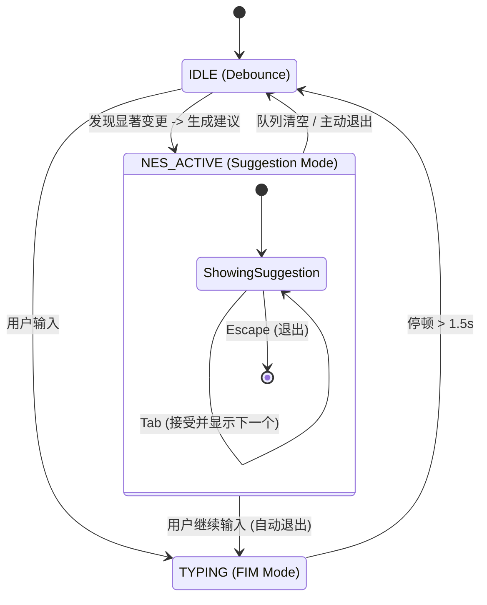

# FIM 与 NES 交互设计最佳实践 (V2.0 优化版)

## 1. 核心设计哲学：分离与渐进

基于 GitHub Copilot NES 和 Cursor Tab Fusion 的深度分析，我们确立了适合当前架构的核心策略：**"Strict Separation, Progressive Reveal"（严格分离，渐进揭示）**。

### 1.1 业界对标分析

| 维度 | GitHub Copilot NES (主要参考) | Cursor Tab Fusion (长期目标) |
|------|-------------------|-------------------|
| **哲学** | 分离：FIM ≠ NES | 融合：一个模型预测所有 |
| **触发** | 用户停止输入后 (Idle) | 实时 + 停止输入 |
| **交互** | Tab 跳转 → Tab 接受 | Tab 接受 + 跳转 (One Station) |
| **视觉** | 箭头 (Gutter) + 灰色文本 | 灰色文本 + 自动跳转 |
| **策略** | **本次优化的核心方向** | 需训练专用模型，成本较高 |

## 2. 优化后的交互模型

我们摒弃之前复杂的 4 状态设计，采用更符合直觉的 **3 状态机 + 预加载队列** 模型。

### 2.1 核心状态机 (Simplified State Machine)

```typescript
enum EditorState {
  TYPING = 'typing',      // FIM 活跃期：用户正在输入，显示实时补全
  IDLE = 'idle',          // 分析等待期：用户停顿，等待 NES 分析
  NES_ACTIVE = 'nes_active' // NES 展示期：显示建议，拦截 Tab/Escape
}
```

### 2.2 交互流程图



## 3. 关键技术实现方案

### 3.1 增强型 Controller 实现

引入 **"预加载队列 (Preloading Queue)"** 策略：一次 API 调用获取多个建议，但界面上一次只显示一个，降低 API 成本并提升响应速度。

```typescript
class NESController {
  private state: EditorState = EditorState.IDLE;
  private preloadedQueue: Prediction[] = [];
  
  // 核心：统一入口
  private handleContentChange(e: IModelContentChangedEvent) {
    // 1. 任何输入立即切回 TYPING 状态
    this.state = EditorState.TYPING;
    this.dismissNES(); // 隐藏之前的建议
    
    // 2. 防抖等待
    this.resetDebounceTimer(() => {
      this.state = EditorState.IDLE;
      
      // 3. 触发分析（仅在显著变更后）
      if (this.isSignificantEdit(e)) {
        this.triggerNESAnalysis();
      }
    });
  }

  // 核心：一次获取，渐进显示
  private async triggerNESAnalysis() {
    // 请求 API，一次获取 3 个相关建议
    const predictions = await this.api.analyze({ maxCount: 3 });
    
    if (predictions.length > 0) {
      // 显示第一个，缓存其余
      this.showSuggestion(predictions[0]);
      this.preloadedQueue = predictions.slice(1);
      this.state = EditorState.NES_ACTIVE;
    }
  }

  // 核心：快捷键拦截
  public onKeyDown(e: KeyboardEvent) {
    if (this.state !== EditorState.NES_ACTIVE) return;

    if (e.code === 'Tab') {
      e.preventDefault();
      this.acceptAndAdvance();
    } else if (e.code === 'Escape') {
      e.preventDefault();
      this.dismissNES();
      this.state = EditorState.IDLE;
    }
  }

  // 接受当前并显示下一个（无延迟）
  private acceptAndAdvance() {
    this.applyCurrentSuggestion();
    
    // 检查队列
    if (this.preloadedQueue.length > 0) {
      // 秒级切换到下一个，无需等待 API
      const next = this.preloadedQueue.shift();
      this.showSuggestion(next);
    } else {
      // 队列清空，重新进入 IDLE 等待下一轮分析
      this.state = EditorState.IDLE;
      // 可选：接受完最后一个建议后，立即触发一轮新的轻量检查
      this.triggerNESAnalysis(); 
    }
  }
}
```

### 3.2 智能触发逻辑 (Significant Edit 2.0)

不再仅依赖简单的字符长度，而是基于 `EditHistory` 进行模式识别。

```typescript
function isSignificantEdit(e: IModelContentChangedEvent, history: EditHistory): boolean {
  // 1. 基础过滤：忽略空白字符和简单换行
  if (isWhitespaceOnly(e)) return false;

  // 2. 意图识别：重命名模式 (Rename Pattern)
  // 如果用户最近连续修改了同一个标识符 > 1 次
  if (detectRenamePattern(history)) return true;

  // 3. 意图识别：参数变更 (Parameter Change)
  // 如果用户在函数定义行进行了修改
  if (isFunctionSignatureLine(e.lineNumber) && e.text.includes(',')) return true;

  // 4. 意图识别：逻辑操作符变更
  // 例如 || 变为 &&，=== 变为 !==
  if (isLogicOperatorChange(e)) return true;

  // 5. 默认策略：非删除类的多字符输入
  return e.text.length > 1;
}

function detectRenamePattern(history: EditEvent[]): boolean {
  // 查找最近的替换操作，看是否有 targetText 相同的操作发生在不同行
  const recent = history.slice(-5);
  // ... 实现逻辑
  return hasPattern;
}
```

## 4. 用户体验原则 (UX Guidelines)

### 4.1 单一焦点原则 (Focus)
*   **Don't**: 同时在屏幕上显示 5 个 Gutter Icon。
*   **Do**: 永远只显示 **1 个** 最相关的建议。

### 4.2 退出机制 (Exit Hatch)
*   用户必须拥有随时拒绝建议的权利。
*   **Escape**: 立即关闭当前建议。
*   **继续打字**: 视为拒绝当前建议，立即清理 UI，切回 FIM 模式。

### 4.3 视觉锚点 (Visual Anchor)
*   NES 不应该直接修改代码，而是使用 **Ghost Text** + **Gutter Icon**。
*   光标跳转应该是“跳到第一个差异点”，而不是行首。

## 5. 实施路线图

### 阶段 1：核心交互重构 (本周)
1.  [Refactor] 将 `NESController` 状态机简化为 3 状态。
2.  [Feature] 实现 `onKeyDown` 拦截，支持 Tab 接受和 Escape 退出。
3.  [Logic] 实现基础版 `isSignificantEdit`。

### 阶段 2：预加载与智能触发 (下周)
1.  [Feature] 实现 `preloadedQueue` 队列逻辑。
2.  [Logic] 完善 `detectRenamePattern` 等高级触发逻辑。
3.  [UI] 优化 Gutter Icon 的视觉样式。

### 阶段 3：跨文件与上下文 (未来规划)
1.  [Research] 探索 Cross-file analysis。
2.  [ML] 收集用户接受/拒绝数据，优化排序模型。

---
**总结**：这一版方案通过引入队列预加载解决了"多条预测"与"视觉简洁"的矛盾，通过简化状态机解决了"交互混乱"的问题，是最适合当前阶段的优化方案。
