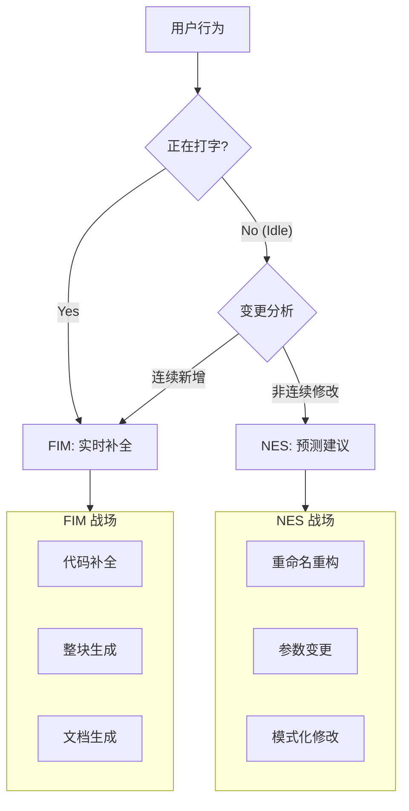

# FIM vs NES: 应用场景与能力边界权威指南 (Detailed Version)

本文档基于业界最佳实践（GitHub Copilot 2025, Cursor Tab），明确界定了 FIM (Fast-In-Middle) 与 NES (Next-Edit-Suggestion) 的能力边界、应用场景及交互准则。这是指导双引擎协同工作的核心法理依据。

## 1. 核心定义与心智模型对比

| 维度 | FIM (Fill-In-Middle) | NES (Next Edit Suggestion) |
| :--- | :--- | :--- |
| **角色定位** | **The Creator (创造者)** | **The Maintainer (维护者)** |
| **用户心智** | "我正在写这个，帮我把剩下的吐出来" | "我改了这里，帮我看看哪里坏了/也要改" |
| **交互模式** | **Flow (流式)**：顺滑、无需思考、肌肉记忆 | **Step (步进式)**：思考、确认、跳转 |
| **光标行为** | **Stay & Extend** (光标不动，文本向后延伸) | **Jump & Mutate** (光标跳跃到新位置，进行修改) |
| **触发机制** | **Typing** (输入触发，< 500ms 延迟) | **Idle** (停顿触发，> 1500ms 防抖) |
| **取消机制** | 继续输入即接受（部分）或 覆盖 | 继续输入即 **销毁** (Reject) |

---

## 2. 全场景地图 (The Full Landscape)

本节提供了完整的编码场景清单，严格划分了 FIM 和 NES 的“绝对统治区”。

### 2.1 场景 A：FIM 的绝对统治区 (Creator's Zone)

这些场景下，用户的意图是 **"Create/Write" (创作)**，必须使用 FIM。**严禁 NES 介入。**

| 场景名称 | 典型用户行为 | FIM 表现 (预期行为) | 为什么不能用 NES？ |
| :--- | :--- | :--- | :--- |
| **Boilerplate 生成** | 输入 `useEffect(() => {` | 直接生成完整的 `fetch` + `setState` + `cleanup` + `Dependency Array`（可能 10 行）。 | NES 是用来改旧代码的，不是用来写新代码的。 |
| **单元测试编写** | 输入 `it('should return 404',` | 生成完整的测试体，包括 `mock` 和 `expect`。 | 这是一个流式过程，不需要跳跃。 |
| **JSDoc 注释** | 输入 `/**` | 读取下方函数，生成完整的文档块。 | 这是最经典的多行 FIM。 |
| **中间插入逻辑** | 在 Express 中间件链中回车 | 根据上下文插入一个新的 `app.use(...)`。 | 虽然是修改，但是是在光标处“撑开”空间，属于 FIM。 |
| **快速实现接口** | `class Foo implements Bar {` | 自动生成所有需要实现的接口方法存根。 | 属于从零生成的范畴。 |
| **HTML/JSX 结构** | 输入 `<div className="card">` | 自动闭合标签并填充常见的子元素结构。 | 下文流式生成，无需跳转。 |

### 2.2 场景 B：NES 的绝对统治区 (Maintainer's Zone)

这些场景下，用户的意图是 **"Maintain/Refactor" (维护)**，必须使用 NES。**FIM 在这里无能为力。**

| 场景名称 | 典型用户行为 | NES 表现 (预期行为) | 为什么 FIM 不行？ |
| :--- | :--- | :--- | :--- |
| **重命名重构** | 修改了函数名/变量名 | **Gutter Icon** 指向该函数的所有**引用处**，建议同步修改。 | FIM 看不到其他行，更没法帮你飞过去改。 |
| **参数列表变更** | 给函数加了 `context` 参数 | **Gutter Icon** 指向调用处，建议传入 `ctx` 或 `null`。 | 同上，属于远程修复。 |
| **遗留代码清理** | 删除了一个废弃变量的定义 | **Gutter Icon** 指向该变量的使用处，建议删除这一行。 | 这种"远程控制"是 NES 的核心。 |
| **逻辑同步修改** | 改了 `if (isProd)` 的逻辑 | **Gutter Icon** 指向 `else` 块或其他环境判断处，建议对应的修改。 | 非连贯的逻辑跳跃。 |
| **类型定义变更** | 在 interface 中新增字段 | **Gutter Icon** 指向实现该接口的对象/类，建议补全字段。 | 跨越空间的补全。 |
| **模式化批量修改** | 改了 Switch Case A 的写法 | **Gutter Icon** 指向 Case B, C, D，建议应用相同的重构模式。 | 典型的“理解意图并批量应用”。 |

### 2.3 场景 C：灰色地带 (The Grey Area)

这里是一些容易混淆的场景，我们制定了**标准仲裁规则**。

| 场景 | 情况描述 | 仲裁结果 | 理由 |
| :--- | :--- | :--- | :--- |
| **修改相邻行** | 用户改了第 1 行，第 2 行也需要改。 | **NES** | 虽然离得很近，但需要光标**跳跃**（换行）。只要涉及光标移动，就是 NES (Tab Jump)。 |
| **重写整个函数** | 用户删除了函数体，准备重写。 | **FIM** | 光标停在函数头，新的函数体是从光标处**流出来**的。这是 FIM。 |
| **插入新 Import** | 用户写代码用了一个没引入的库。 | **NES** | 需要跳到文件头部去加 `import` 语句，这是典型的跳转修改。 |

---

## 3. 深度 Case 分析

### 3.1 样板代码多行生成 (FIM Case)

FIM 必须能够一次性生成完整的代码块。

```typescript
// 用户输入：
const memoizedCallback = useCallback(

// FIM 预测（多行 Ghost Text）：
  () => {
    doSomething(a, b);
  },
  [a, b], // 自动推断依赖数组
);
```

### 3.2 逻辑镜像修改 (NES Case)

NES 预测 `else` 分支也需要类似修改。

```typescript
if (isProd) {
  // 用户修改：增加了 await 和错误处理
  try {
    await sendMetric();
  } catch (e) { console.error(e); }
} else {
  // NES 预测 (Gutter Icon)：这里也应该加 try/catch
  sendMetric(); 
}
```

---

## 4. 冲突仲裁与边界判定 (The Golden Rules)

### 规则 1：连通性法则 (Connectivity Rule)

| 情况 | 归属引擎 | 判定标准 |
| :--- | :--- | :--- |
| **连续文本流** | **FIM** | 只要生成的字符是**紧接着光标**流出来的，不管多长（1行还是100行），都是 FIM。 |
| **跳跃编辑** | **NES** | 只要需要光标**瞬间移动**（Jump）哪怕一个字符去改后面的东西，就是 NES。 |

### 规则 2：时序独占法则 (Time Exclusivity)

这个表格定义了不同状态下，Tab 键的归属权。

| 用户/编辑器状态 | FIM 状态 | NES 状态 | **Tab 键归属** | UI 表现 |
| :--- | :--- | :--- | :--- | :--- |
| **Typing (输入中)** | Active | Blocked | **FIM** (Accept) | 显示 Ghost Text |
| **Idle (停顿 < 1.5s)** | Active (未消失) | Analyzing | **FIM** (Accept) | 保持 Ghost Text |
| **Idle (停顿 > 1.5s)** | Inactive | **Ready** | **NES** (Jump) | 显示 Gutter Icon |
| **NES Preview** | Inactive | Active | **NES** (Apply) | 显示 Diff View |

### 规则 3：拒绝判定 (Rejection Policy)

如何判断用户不喜欢当前的建议？

*   **FIM 拒绝**：用户打出了与建议不一致的字符 -> FIM 自动重新计算。
*   **NES 拒绝**：
    1.  **继续打字**：用户无视图标，继续写代码 -> **立即销毁建议**。
    2.  **按 Esc**：明确关闭建议。
    3.  **反向修改**：用户修改了 NES 建议所依赖的上游代码 -> 建议失效。

---

## 5. 总结图谱


