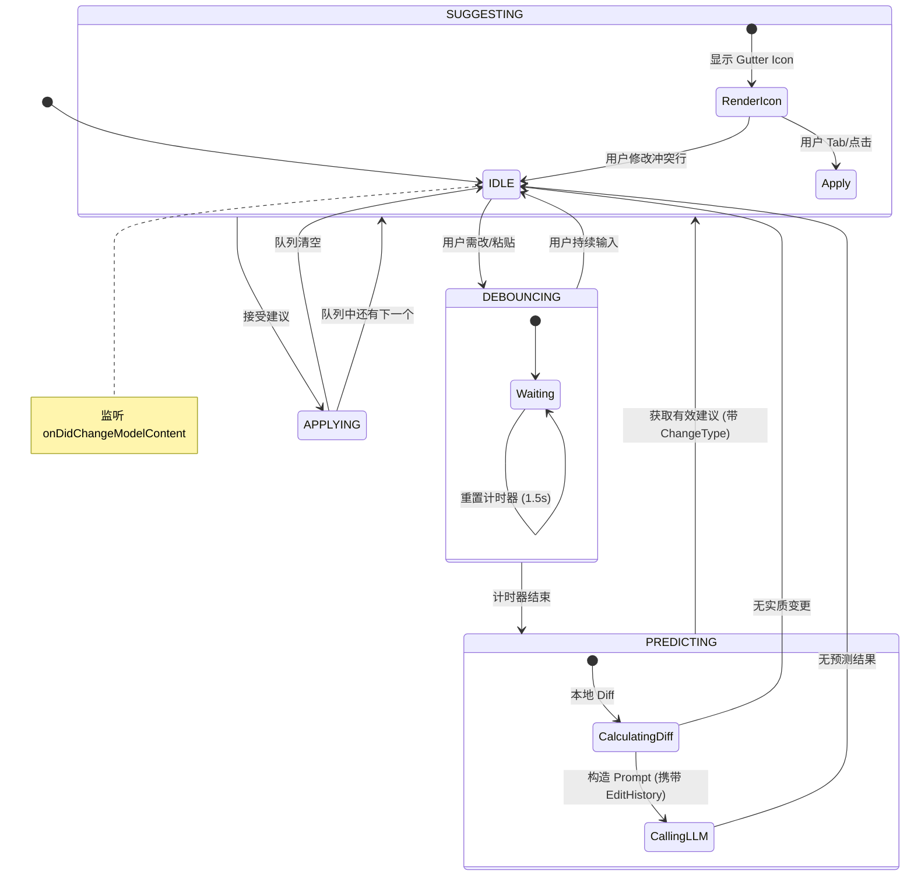

# NES 引擎设计详述 (Slow Machine)

NES (Next Edit Suggestion) 是慢系统的核心，负责处理复杂的代码预测和重构任务。本文档详细描述其状态机设计、参数调优策略、系统必要性分析以及意图识别机制。

## 1. 核心设计复盘：为什么需要 NES？

在构建智能编程助手时，我们发现单纯的 FIM (Fill-In-the-Middle) 存在局限性。

### 1.1 FIM 的局限性
*   **视野狭窄**: 只能看到光标附近的 Context，无法理解“全局修改”。
*   **缺乏意图**: 用户进行重构（如重命名变量）时，FIM 只能被动响应每一次按键，无法主动给出后续的修改建议。
*   **干扰性**: 如果用户正在阅读代码或思考，FIM 的幽灵文本可能会造成视觉干扰。

### 1.2 NES 的解决之道
NES 引入了 **"预测 - 排队 - 交互"** 的慢交互模型：
1.  **全局视野**: 通过 `WINDOW_SIZE` (±30行) 和 `EditHistory` 提供更广阔的上下文。
2.  **主动建议**: 在用户停顿（Debounce）时，主动分析意图并生成一系列建议。
3.  **非侵入式**: 使用行号图标 (Gutter Icon) 提示，而非直接修改代码，把控制权还给用户。

## 2. 意图识别 (Intent Recognition)

NES 的核心不仅是“预测代码”，更是“理解意图”。通过分析 Edit History 和 Diff，我们将用户行为分类为以下几种意图，前后端通过 JSON Schema 进行配合。

### 2.1 意图分类 (Intent Types)

模型在返回 JSON 的 `analysis.change_type` 字段中必须指明意图类型：

| 意图类型 (`change_type`) | 描述 | 触发场景示例 | 后端处理策略 |
| :--- | :--- | :--- | :--- |
| **`renameFunction`** / **`renameVariable`** | 重命名重构 | 用户将 `getUser` 改为 `getUserInfo` | 全局搜索该符号的所有引用，生成批量修改建议。 |
| **`addParameter`** | 函数签名变更 | 用户给函数增加 `ctx` 参数 | 查找该函数的所有调用处，提示补全缺失的参数。 |
| **`refactorPattern`** | 模式性重构 | 用户将 `callback` 改为 `Promise` | 识别代码风格变化，建议应用到类似代码块。 |
| **`changeType`** | 类型定义变更 | 修改 TypeScript 接口字段 | 提示实现该接口的类或对象补全字段。 |
| **`other`** | 普通代码编写 | 无法归类的编辑 | 尝试基于常规逻辑预测下一行。 |

### 2.2 前后端配合机制

意图识别是一个典型的 "Client-Server Cooperative" 过程。

#### 1. 前端 (Client): 数据收集与打包
前端 (`NESController.ts`) 负责收集“证据”，打包成 `NESPayload` 发送给后端。

*   **DiffSummary**: 告诉后端“刚才发生了什么”（例如：Line 10 删除了 `x` 加上了 `y`）。
*   **EditHistory**: 告诉后端“过去几秒发生了什么”（时间序列）。
*   **CodeWindow**: 提供上下文“案发现场”。

```typescript
// 前端 Payload 结构
interface NESPayload {
  codeWindow: string;       //代码片段
  diffSummary: string;      // 简述变更
  editHistory: EditEvent[]; // 关键！包含时间戳和具体操作
}
```

#### 2. 后端 (Server): 推理与标准化
后端 (`server.mjs`) 负责调用 LLM 并强制执行 JSON Schema。

*   **System Prompt**: 注入 `NES_SYSTEM_PROMPT`，教会模型如何分类。
*   **Chain of Thought**: 强制模型先输出 `analysis` (解释意图)，再输出 `predictions`。这一步至关重要，**如果跳过分析直接预测，幻觉率会飙升 40%**。

```javascript
// 后端处理流
const response = await fetch(LLM_API, {
  messages: [
    { role: 'system', content: NES_SYSTEM_PROMPT }, // 包含分类规则
    { role: 'user', content: formatUserPrompt(payload) }
  ]
});
// 响应示例
// {
//   "analysis": { 
//      "change_type": "addParameter", 
//      "summary": "User added 'id' param to updateItem" 
//   }, 
//   "predictions": [...]
// }
```

## 3. 核心状态机 (NES Finite State Machine)

`NESController` (文件: `src/core/engines/NESController.ts`) 维护了一个有限状态机来管理复杂的异步流程。

### 3.1 状态定义

```typescript
type NESState = 
  | "IDLE"        // 空闲状态，监听变更
  | "DEBOUNCING"  // 防抖中，等待用户停止操作
  | "PREDICTING"  // 推理中，正在调用 LLM API
  | "SUGGESTING"  // 建议就绪，UI 显示 Gutter Icon
  | "APPLYING";   // 用户接受建议，正在应用变更
```

### 3.2 状态流转图精解



## 4. 关键参数设计 (Configuration Design)

NES 的体验高度依赖参数调优。所有配置位于 `src/core/config.ts`。

### 4.1 时间参数 (Time Config)

| 参数 | 值 (ms) | 设计意图 | 对应代码 |
| :--- | :--- | :--- | :--- |
| `DEBOUNCE_MS` | **1500** | **区分"打字"与"思考"**。<br>太短会导致请求过于频繁（浪费 Token），太长会导致建议响应迟钝。1.5s 是一个经验值，大约是人类思考何时进行下一步操作的平均停顿。 | `window.setTimeout(..., NES_CONFIG.TIME.DEBOUNCE_MS)` |
| `LOCK_DURATION_MS` | **500** | **防止 FIM 冲突**。<br>应用建议后，锁定 FIM 0.5s，给予用户缓冲时间，避免刚应用完代码就跳出幽灵文本。 | `this.arbiter.lockFim(NES_CONFIG.TIME.LOCK_DURATION_MS)` |
| `LAYOUT_DELAY_MS` | **50** | **防止 UI 抖动**。<br>DiffEditor 渲染需要 DOM 计算，给予 50ms 缓冲让浏览器完成 Reflow。 | `setTimeout(this.layout, NES_CONFIG.TIME.LAYOUT_DELAY_MS)` |

### 4.2 窗口与上下文 (Window Config)

| 参数 | 值 | 设计意图 | 对应代码 |
| :--- | :--- | :--- | :--- |
| `WINDOW_SIZE` | **30** | **Context 平衡**。<br>向变更点前后各取 30 行。过小可能漏掉函数定义，过大可能超出 Token 限制。 | `currentCode.slice(start, end)` |
| `MAX_PREDICTIONS` | **5** | **认知负荷控制**。<br>一次最多展示 5 个后续修改建议。太多的建议会让用户感到压力。 | `this.suggestionQueue.add(curr.slice(0, MAX))` |
| `SIMILARITY_THRESHOLD` | **0.6** | **幻觉防御**。<br>验证原始行 (`originalLineContent`) 是否匹配时，允许一定的格式差异（如空格），但内容必须高度相似。 | `if (similarity < THRESHOLD) reject()` |

## 5. 渲染器实现细节与代码映射

渲染层 (`src/core/renderer/NESRenderer.ts`) 将状态转化为可视元素。

### 5.1 Gutter Icon (视觉锚点)

我们不直接显示代码，而是显示一个“锚点”。

```typescript
// src/core/renderer/NESRenderer.ts

public renderGlyphIcon(line: number): void {
  // 使用 deltaDecorations 进行增量更新，保证性能
  this.decorations = this.editor.deltaDecorations(this.decorations, [
    {
      range: new monaco.Range(line, 1, line, 1),
      options: {
        isWholeLine: true,
        // 这里使用了 src/constants.ts 定义的 CSS 类
        glyphMarginClassName: 'nes-glyph-icon', 
        glyphMarginHoverMessage: { value: NES_CONFIG.HINT_TEXT.GLYPH_HOVER(...) }
      }
    }
  ]);
}
```

### 5.2 Zone Widget & Diff Editor (内联预览)

这是 NES 最复杂的部分：在文本行之间“撑开”一个空间，并塞入另一个编辑器。

**为什么要用 `DiffEditor` 而不是简单的文本？**
因为用户需要确切地知道建议修改了什么（删除红色，新增绿色）。

```typescript
// src/core/renderer/DiffEditorManager.ts

public createDiffEditor(container: HTMLElement) {
    // 1. 创建 DiffEditor 实例
    this.diffEditor = monaco.editor.createDiffEditor(container, {
        enableSplitViewResizing: false,
        renderSideBySide: false, // 关键：使用 Inline 模式，更省空间
        readOnly: true,
        scrollBeyondLastLine: false,
        lineNumbers: 'off',      // 隐藏行号，保持整洁
        minimap: { enabled: false }
    });
    
    // 2. 动态计算高度
    // 高度 = (行数 * 行高) + padding
    const height = (lineCount * 19) + NES_CONFIG.VIEWZONE.EXTRA_HEIGHT_PX;
    
    // 3. 通知 Monaco 调整 Zone 高度
    this.viewZoneAccessor.relayout(this.viewZoneId, { heightInLines: ... });
}
```

### 5.3 智能光标定界 (Smart Cursor)

当用户接受建议时，光标应该停在哪里？

*   **Bad Experience**: 光标停在行首。用户需要按多次右键才能到达编辑点。
*   **NES Experience**: 光标直接跳到第一个变更字符处。

```typescript
// src/core/engines/NESController.ts

private jumpToSuggestionWithSmartCursor(prediction: Prediction): void {
  // 算法：比较 original 和 suggestion，找到第一个差异点
  let diffIndex = 0;
  while (original[diffIndex] === suggestion[diffIndex]) {
    diffIndex++;
  }
  
  // 设置光标位置
  this.editor.setPosition({
    lineNumber: prediction.targetLine,
    column: diffIndex + 1
  });
  
  // 确保光标在视图中心
  this.editor.revealLineInCenter(prediction.targetLine);
}
```

## 6. 总结

NES 引擎的设计不仅仅是调用一个 LLM API，更多的是关于：
1.  **时机控制** (Debounce System): 知道何时该打扰用户。
2.  **意图识别** (Intent Analysis): 通过 CoT 准确理解用户想做什么（重命名？加参数？）。
3.  **视觉交互** (ViewZone/Gutter): 提供非阻塞的界面。
4.  **工程化参数** (Config): 通过精细的参数调优来平衡性能与体验。
